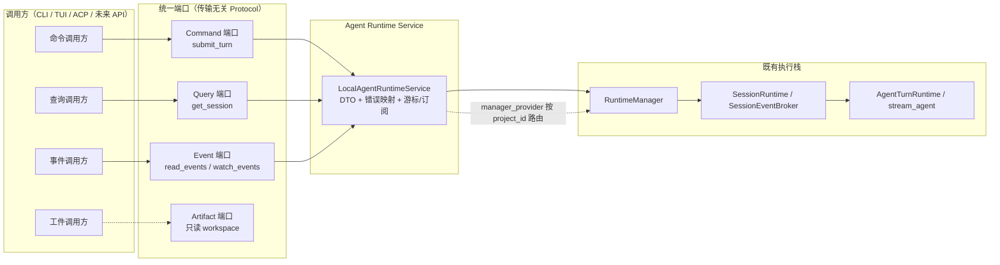

# 统一 Agent Runtime Service 总体方案

> 文档状态：Completed（S10 consumer implementation 与 final gates complete）<br>
> 实施状态：`completed`；实际门禁证据与进程内测试说明见 [progress.md](progress.md)<br>
> 架构决策记录：[decisions.md](decisions.md)<br>
> 与既有解耦计划的关系：本服务位于 [Agent Runtime 解耦](../agent-runtime-decoupling/index.md) 之上，复用其 RuntimeManager/SessionRuntime 执行栈（ADR-011）。

## 1. 结论

为调用方提供传输无关的进程内应用服务：通过统一 DTO 与端口完成 submit turn、查询 session、读取事件以及异步 watch（replay + live）。执行路径唯一经过：

```
AgentRuntimeService -> RuntimeManager.submit_ref/resume_ref -> SessionRuntime -> AgentTurnRuntime
```

- 进程内 service 与 in-process facade/remote client 使用同一纯 application DTO ports；agent metadata 留在 composition，不走 wire。
- CLI、TUI、ACP 默认路径均已迁移到 service contract；legacy `ui.stream.stream_agent` 仅作为兼容 utility 保留。
- 事件游标使用 session 级 sequence（`SessionEventEnvelope.sequence`），turn-local sequence 作为独立字段保留。
- 所有公共会话身份使用现有 `SessionRef(project_id, thread_id)`。

## 2. 目标架构



- **Command 端口**：`SubmitTurnCommand -> CommandReceipt`（receipt 只在 manager 取得并发配额并启动 turn 后返回，是真实背压而非预先排队确认；不暴露执行对象）。
- **Query 端口**：`GetSessionQuery -> SessionView`（SessionSnapshot 的纯数据投影，不含 goal）。
- **Event 端口**：`ReadEventsQuery -> EventPage` 轮询，以及 `watch_events` 的 replay+live 订阅。
- **Artifact 端口**：S4 提供 `stat_artifact`、`list_artifacts`、`read_artifact`，只读已存在 session 的 workspace。

## 3. 阶段划分

| 阶段 | 内容 | 状态 |
|---|---|---|
| S0 | 基线确认：执行栈、事件契约、测试模式 | 完成 |
| S1 | 进程内纵向切片：DTO、端口、LocalAgentRuntimeService、broker gap 语义 | 完成（含六轮硬化修复，本文档） |
| S2 | 会话生命周期命令扩展（cancel/steer/close/open） | 完成 |
| S3 | 事件契约收口：过滤、扫描边界、重连与事件大小 | 完成 |
| S4 | Artifact 端口与工件投影 | 完成 |
| S5 | 多 manager 路由硬化与项目发现集成 | 已实现（门禁验证见 progress） |
| S6 | 鉴权与权限边界（进程内 ACL） | 完成 |
| S7 | 网络传输（JSON-RPC/WebSocket） | 已完成（门禁验证见 progress） |
| S8 | daemon 进程与生命周期管理 | 完成 |
| S9 | 重连、版本协商与兼容矩阵 | 已完成（门禁验证见 progress） |
| S10 | 迁移 CLI/TUI/ACP 消费者并删除过渡路径 | completed；legacy stream utility 保留兼容 |

### S2 交付与门禁

S2 已完成并冻结：四个生命周期命令、turn fencing、open/close generation 语义及并发资源清理均已交付。专项测试、核心回归、全量测试、Ruff、diff 检查和 MkDocs strict 门禁均通过；详见 [S2 生命周期专项验证记录](s2-lifecycle-verification.md)。

### S3 事件契约

S3 已完成：`EventFilter` 在 raw envelope metadata 上进行 AND 匹配；read 使用独立 `scan_limit` 与 raw session cursor 分页；watch 暴露线程安全的 `EventStream.cursor` 供客户端自行重连；完整 `RuntimeEvent` 使用 canonical UTF-8 JSON 字节数执行显式 `event_too_large` 边界。S3 专项已扩展为 20 个确定性门禁用例。这里的游标不是 durable event log，也不提供服务端持久化；网络传输属于 S7，版本协商属于 S9。

### S4 Artifact 端口

S4 提供进程内只读的 workspace artifact 端口：已存在 session 的 `workspace` 是唯一 authority；文件和目录使用安全的相对 POSIX path，遵循 ToolIgnoreMatcher，且 ignore/deny/default-ignore policy 同时检查请求逻辑 path 与 resolved symlink target，避免 alias 绕过。`ArtifactRef.path='.'` 仅对 list root 合法，stat/read 拒绝；文件通过 bounded base64 chunks 和 revision token 读取。list 只枚举直接子项、稳定排序并使用不透明 cursor；cursor 与 expected revision 均有 UTF-8 字节上限。S4 的 scope 是 workspace scope，不等同于用户 ACL，鉴权仍留在 S6。S4 安全审阅修复、专项门禁与 service 回归已完成。

### S5 多 manager 路由

S5 提供 `RuntimeManagerRouter` 与 `RuntimeProject`：项目发现只接受精确
`project_id`，每项目构建 single-flight，已发布 generation 不替换，且不同
项目的 manager 与 session/event/workspace 状态相互隔离。router shutdown 会等待
在途构建并并发关闭全部 manager；关闭后的 service 入口返回稳定的 `closed` 错误。
本阶段仍不提供 ACL（S6）、网络传输（S7）或 daemon 生命周期（S8）。

### S7 JSON-RPC/WebSocket 传输

S7 已完成：`synapse.runtime.transport` 提供严格 JSON-RPC 2.0/WebSocket adapter，包含认证绑定、固定 wire error、bounded writer、inflight/subscription reservation、response acknowledgement barrier，以及 disconnect/overflow/writer failure 的幂等清理。watch terminal error 只发送一次 error、不发送 complete；detach 不关闭 session 或取消 active turn。详细 wire 表与实际门禁数字见 [S7 wire protocol](s7-wire-protocol.md)、[ADR-S-015](adr-s-015-json-rpc-websocket.md) 与 [progress.md](progress.md)。

### S8 daemon 进程与生命周期

S8 提供 foreground-only 的 `synapse-runtime` 与 `python -m synapse.runtime.daemon`。
daemon 独占持有型 state lock，ready 后发布不含 credential 的 discovery metadata，并按
server、router、catalog、lease 的逆序顺序收敛资源。token 仅来自受限 token 文件；
SIGINT/SIGTERM 共享 stop event。实例采用 one-shot 状态机，启动失败和启动前 shutdown
均不可 restart。S8 生命周期安全测试全部使用进程内注入 fake server/resource、event
和 barrier；不声称执行真实子进程 daemon 验证。S9 重连/版本协商及 S10 CLI/TUI/ACP
消费者迁移不在本阶段。
详细决策见 [ADR-S-016](adr-s-016-daemon.md)。

### S9 重连、版本协商与兼容矩阵

S9 已完成：S9 专项 94 passed；S9 + S7 transport 154 passed、9 warnings；S8
专项 22 passed、1 skipped；核心回归 467 passed；全量 2257 passed、2 skipped、9
warnings。Ruff、`git diff --check`、`mkdocs build --strict` 与 `uv build` 均通过。
本轮仅记录主流程独立权威门禁结果，不声称执行真实子进程验证；S10 消费者迁移已完成，最终结果见 [progress.md](progress.md)。

### S6 进程内 ACL

S6 使用 `Principal`、精确 project/thread scope 的 `AclGrant` 与稳定 capability
字符串，在全部 service 应用端口外提供 fail-closed
`AccessControlledAgentRuntimeService`。wrapper 先做最小 DTO 校验，再授权，再
触达 delegate；拒绝统一为 `permission_denied`，不泄露资源存在性。watch lease
在创建时授权并固定 capability snapshot，退出只关闭 subscription。S6 不读取
settings 或 runtime safety，不迁移 CLI/TUI/ACP；网络身份、daemon 与消费者迁移
分别留在 S7、S8、S10。

## 4. S1 状态与门禁

S1 交付（含六轮硬化审查修复）：

- 新包 `src/synapse/runtime/service/`：`commands.py`、`queries.py`、`events.py`、`errors.py`、`ports.py`、`local.py`。
- DTO 全部 frozen；`config_overrides` 构造时 `deepcopy` 隔离 + 顶层只读（嵌套值不承诺深度不可变）；事件 payload 经递归 JSON normalizer 严格投影（`json.dumps(dataclasses.asdict(event), allow_nan=False)` 恒可序列化），不暴露 `TurnEvent` 实例。
- `SessionEventBroker` 新增 `SessionEventWindow`/`read_after`/`subscribe_from`（严格游标 `0..latest`，stale cursor 原子 gap 检测，订阅关闭通知恰一次）；`_LOSSLESS` 全量保留新增硬上限。
- `watch_events` 是 context-only lease（`EventWatch`/`EventStream` 双 Protocol）：订阅延迟到 `__aenter__`，未 enter 不注册；broker 回调经 `threading.Lock` 有界 ingress + 单 drain 合并投递，溢出是吸收性终态（恰一次 `event_overflow` 后 EOF）；source close 唤醒 blocked stream 且先消费已接受事件再 EOF，绝不关闭/取消 session。
- sessions 层提供 typed 异常（`SessionBusyError`/`RuntimeClosedError`/`InvalidEventCursorError`），service 只映射 typed busy/closed，普通 `RuntimeError` 原样上抛。
- 错误码：`not_found`、`conflict`、`replay_gap`、`closed`、`invalid_session`、`event_overflow`、`invalid_cursor`、`invalid_request`、`invalid_event_payload`。
- 新增测试：`tests/test_runtime_service_contracts.py`、`tests/test_runtime_service_local.py`，并在 `tests/test_session_runtime.py` 补充 broker 用例。

第三轮硬化修复（2025-08 独立 reviewer 复现并全部修复）：

1. `_drain()` 投影锁外化：锁内仅 detach 批次并维护共享状态，锁外执行 JSON 投影，再短暂加锁提交或进入终止状态；投影期间并发 overflow/source close/consumer close 均正确处理，投影结果不写回已终止 stream，`_pending` 不变量保持。确定性测试用 blocking Mapping/barrier 卡住投影并验证 producer 快速返回。
2. `_schedule_drain()` 在 event loop 已 closed 时锁内抓取 subscription、锁外 `close()`，registry 不泄漏；幂等兼容 broker close/overflow/context exit。
3. `SessionEventBroker.close()` 在 close 线性化时快照待通知 records；并发 `subscription.close()` 不删除 pending `on_close`；accepted event 先于 `on_close`；恰一次，无死锁。
4. `open()` replay 投影在锁外，发布时在 `_ingress_lock` 内重查 overflow/closed/error；已终止不写回；source close 仍允许已捕获 replay 发布后 drain 到 EOF。
5. JSON 错误消息脱敏：非字符串 mapping key 只报类型，non-finite float 不回显值，未知类型可报 type。
6. set 投影用规范 JSON 排序 key（`sort_keys=True`、`allow_nan=False`、`separators=(",",":")`、`ensure_ascii=False`），不再用 repr fallback；dict 插入顺序不影响 set 投影顺序。
7. `read_after`/`subscribe_from` 对 `bool`/`float`/`str` 游标抛 `InvalidEventCursorError`（`False` 不当 `0`）；异常保存原始 `requested`（`object`），消息只报类型/范围；service 映射 `InvalidCursorError`。

第四轮硬化修复（独立 reviewer 复现并全部修复）：

1. broker 有序投递：`emit` 锁内分配 sequence、保留 event、快照 subscriber 并按 sequence 入队 `_delivery`；单一 drainer（`_dispatching` 互斥）在锁外串行调用 callbacks（严格 sequence 顺序、无常驻线程），callback 可重入 `emit`/`close`/`subscription.close`/`subscribe`/`read` 而不死锁；`close` 线性化时拒绝新 emit 并快照 `on_close` 通知集合，drainer 先投递全部 close 前已接受事件、再对每个 `on_close` 恰一次通知；unsubscribe 不抹掉已线性化 emit 的 snapshot 事件与 pending `on_close`；慢 subscriber 只拖慢自身流与 close 通知时序，不阻塞 broker 锁、不重排其他 subscriber。
2. `project_payload` 公共边界把 producer 代码（Mapping.items / dataclass getter / 迭代 / Enum.value / bytes conversion / `os.fspath` / isoformat / Decimal / UUID 等）抛出的普通 `Exception` 归一化为 `InvalidEventPayloadError`（`raise ... from None`、消息只含安全顶层类型、`__cause__ is None`）；不捕获 `BaseException`；内部已知错误原样保留。
3. first-terminal-wins：`open()` replay 投影与 `_drain()` detached commit 统一 `_fail_locked`，overflow 与 projection error 先线性化者胜出；恰一次 error 后 EOF、无 tail。
4. `LocalEventWatch.__aenter__` 失败后 lease 永久 closed/failed 且不可再 enter，broker 前后无 subscriber；正常 exit 幂等。

第五轮硬化修复（独立 reviewer 复现并全部修复）：

1. producer 自抛 `InvalidEventPayloadError` 不再被公共边界放行：内部可信 rejection 改用私有 `_ProjectionRejected` 标记，公共 `project_payload` 只认该标记并转为精确公开类型（保留安全消息、`from None`）；producer 抛出的普通 `Exception` 或它自己构造的 `InvalidEventPayloadError` 一律新建脱敏错误（只报安全顶层类型，`__cause__` 为 None），任意嵌套深度都经过公共边界；`BaseException`（`KeyboardInterrupt`/`SystemExit`/`asyncio.CancelledError`）仍原样穿透。
2. `LocalEventStream.open()` replay 投影与 `_drain()` live 投影的 `BaseException` 确定性清理：无论异常类型，已注册 subscription 都会关闭（broker registry 不泄漏）、failed lease 可观察且不可重入；live 侧进入终态 EOF 并唤醒 reader，原异常原样传播（不转 service error、不吞）。
3. `SessionEventBroker.forward_to()` 的 replay 与 live 共用有序 dispatcher：订阅注册与全部 replay 入队在同一锁临界区，并发 `emit()` 严格排在其后，replay 全部投递后才投递 live；callback 锁外、可重入、无常驻线程；`subscribe()` 的“调用者手动消费 replay”兼容语义不变。

第六轮硬化修复（本轮，独立 reviewer 复现并全部修复）：

1. `SessionEventBroker._dispatch()` 对 observer `BaseException` 的确定性恢复（ADR-S-009）：普通 `Exception` 维持 observer failure isolation（继续投递、不传播）；非进程级 `BaseException`（含 `asyncio.CancelledError`）不停止 drainer——同一 envelope 的后续 subscriber records 与后续 queued delivery 仍按 sequence 严格投递，记录第一 `BaseException`，drainer 完成全部已接受 delivery（及 pending `on_close`）后重新抛给认领 drainer 的 emitter/close 调用栈；`KeyboardInterrupt`/`SystemExit` 终止当前 delivery（尚未调用的 records 放弃）并立即重抛，`_dispatching` 恢复为 False、剩余 queue 保留给后续 emit/close 认领；若 broker 已关闭时进程级退出逃逸，drainer 先完成剩余 queue 与 pending `on_close` 再重抛（close work 绝不搁浅）。`_notify_closed` 对 `on_close` 采用同一策略；外部 callback/`on_close` 仍在 lock 外执行、无常驻线程、reentrant emit 只入队不递归。

> 有界性：S1 的队列/回放有界性按事件数与投影深度界定；单事件 payload 的字节级上限不属于 S1 承诺，留 S3/传输层收口。

S1 门禁（全部通过，含硬化后新增用例）：

1. DTO frozen / 嵌套 override 防外部突变 / 严格 JSON-safe；import guard 不含 Textual/Typer/ACP/Rich/HTTP/WebSocket/LangChain。
2. submit 只调用 `manager.submit_ref`；receipt 只在 manager 取得并发配额并启动 turn 后返回（真实背压，无第二个 command queue）。
3. typed busy/closed 映射 `conflict`/`closed`；普通 `RuntimeError`（即使文本含 `closed`/`active turn`）原样上抛。
4. 两 session 事件隔离；read 使用 session sequence 并保留 turn-local sequence。
5. replay+live 无 gap/无重复；watch 关闭后 turn 继续并可 settle。
6. 严格游标：`read_after`/`subscribe_from` 拒绝负数与 future 游标；stale cursor 明确 `replay_gap`；空 broker / cursor=latest 合法。
7. 有界队列溢出明确 `event_overflow`（恰一次后 EOF，无 tail；优先于未消费 replay）且订阅清理；burst 下 `call_soon_threadsafe` 合并为常数次、producer 不阻塞。
8. 架构护栏：service 不直接实例化 `AgentTurnRuntime`、不调用 `stream_agent`/`agent.ainvoke`；lease 不可被裸 `async for` 迭代。
9. producer 自抛 `InvalidEventPayloadError` 与普通 `Exception` 一样经公共边界脱敏（新错误、`from None`、无 secret/cause）；内部可信 rejection 以精确公开类型保留安全消息（cycle/depth/key/NaN/unknown）；`BaseException` 原样穿透。
10. replay/live 投影中的 `BaseException` 确定性清理：订阅关闭、failed lease 可观察且不可重入、live 终态 EOF 唤醒 reader；不转 service error、不吞 `KeyboardInterrupt`/`SystemExit`/`CancelledError`。
11. `forward_to` replay 与 live 共用有序 dispatcher：并发 emit 不越过 replay（严格 sequence 顺序）；callback 锁外可重入；callback 内 close 不死锁且 accepted replay 先投递。
12. ordered dispatcher 对 observer `BaseException` 的确定性恢复：非进程级 `BaseException` 不永久 `_dispatching=True`、不丢已接受 delivery/close notification（第一者重抛给认领 emitter，同 envelope 后续 subscriber 继续投递）；`KeyboardInterrupt`/`SystemExit` 终止当前 delivery 且剩余 queue 可由后续 drainer 接管；broker 已关闭时 close work 恰一次完成；普通 `Exception` 隔离与多 subscriber 顺序仍通过。

## 5. 明确不实现（本阶段）

- 网络传输与 daemon：S7/S8 之前不引入进程外通信（ADR-010 仍有效）。
- 远程 DTO 编码：`SubmitTurnCommand.attachments` 及部分嵌套值明确仅进程内兼容。
- 现有消费者迁移：CLI/TUI/ACP 默认路径保持不变。
- S4 安全审阅修复、专项门禁与回归结果已完成；S5 的实现与当前验证状态见
  [progress.md](progress.md)。
