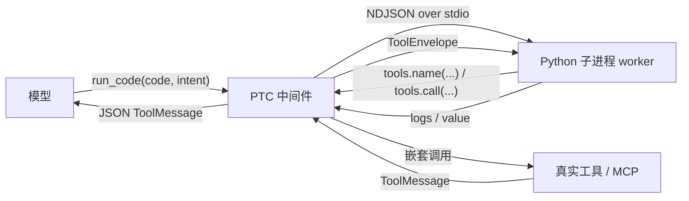

# 程序化工具调用（PTC）

PTC（Programmatic Tool Calling，程序化工具调用）让模型在一次模型回合里，用一段 Python
代码去**编排**多个工具调用，而不是逐个回合地调用工具。

开启后，Agent 会注册一个 `run_code(code, intent)` 工具。模型把 Python 代码作为 `code`
传进来，代码在**一次性的本地 Python 子进程**里执行；代码通过注入的 `tools` 对象回调宿主
进程里的真实工具（包括 MCP 工具），宿主把结果以统一的 envelope 返回给代码，代码用
`print(...)` 输出日志、用 `return` 返回最终值。

!!! note "不是安全沙箱"
    子进程只是崩溃隔离和确定性 I/O 边界，**不是操作系统权限沙箱**。模型代码以与用户
    shell 相同的权限运行：普通 Python 可以直接读写文件、起进程、访问网络，绕开工具白名单。
    子进程的精简环境变量**不是权限隔离**，它只是让运行更确定、避免把宿主密钥带进去。详见
    下文「权限与安全」。

## 适用场景

PTC 的核心价值是**把一段可机械编排的工作压进一次模型回合**，而不是给每次工具调用加一层包装。
**原生工具可见时，单次简单调用直接使用原生工具**；只有确实能减少模型往返或显著压缩输出时才优先用 PTC：

- **结果驱动的依赖链**：搜索 → 从规范结果提取路径、ID 或 URL → 分批获取详情 → 去重、
  分组、排序 → 返回证据。后一步参数来自前一步，不必每一步都交回模型。
- **相关查询的批量编排**：在一次 `run_code` 里提交相关查询，聚合后返回；实际并行能力由
  工具契约决定，不是写了 `gather` 就一定并行。
- **有界分页与归约**：跟随返回的游标，在页数、条目数、调用数和输出预算内完成处理；
  返回汇总与必要证据，而不是把所有原始结果再次打印给模型。

它**不是**用来替代 Agent 自己的规划循环：Agent 仍然决定「做什么」，PTC 只负责把其中
**一段可机械编排的工作**用代码跑完。需要审批、需要写会话状态、需要返回图状态的工具不适合
放进 PTC（见下文「工具编排规则」）。
提取路径、跟随游标、应用用户给定的筛选条件属于机械步骤；判断根因、选择修复方案属于语义判断，
应交回模型。遇到未知结果结构或预算耗尽时也应停止，报告已获得的部分结果。

### 如何选择工具

`run_code` 的工具描述、完整 SDK 和超预算时的精简 SDK 使用一致的选择规则：

| 场景 | 建议 |
|---|---|
| 单次简单调用，原生工具可见 | 直接调用原生工具；不要仅为执行脚本而包装一次 `execute`，不为凑批量增加无关查询。 |
| 相关的独立查询 | 能减少模型往返时优先用 PTC；用 `asyncio.gather` 批量提交，遵守并发上限（默认 8）和工具契约。 |
| 下一步参数可从结果机械确定 | 在同一块内继续依赖链；阶段之间顺序 `await`，各阶段内部可批量提交独立查询。 |
| 分页、过滤、关联、聚合或显著的输出归约 | 优先 PTC；使用已发布的 `data` schema，限制工作量和输出，标注完整性。 |
| 下一步需要语义判断、结果结构未知或预算耗尽 | 结束代码块，返回必要证据、失败信息及部分结果，再由模型决定。 |
| 写/编辑类调用，以及任何会改变状态的操作 | 原生工具可见时保持原生调用；`code` 模式下工具被隐藏时，仅在获准情况下用最小 `run_code` 调用。不得绕过审批或工具限制。 |
| `run_code` 不可用，或目标工具不可编排 | 使用可用的原生工具；不更改模式或绕过限制。 |

用户明确要求使用 `run_code` 时遵循该要求。以上规则通过提示引导工具选择，不是运行时强制拦截；权限检查仍独立生效。
`code` 模式下原生工具被折叠时，单次调用仍可能需要最小包装，这是工具可见性例外，而不是要求制造批次。

内置基础系统提示使用同样的选择规则；PTC 中间件还会在每次模型请求的系统消息中
追加完整或精简 SDK，因此已存在的外部 `system_prompt.md` 也能收到新的 PTC 指引。
外部提示文件不会被自动覆盖；若其中仍要求“所有只读调用默认包装，单次也不例外”，应手动删除冲突条款。

不要猜测结果 schema，或从不稳定文本中拼出未经确认的结构。分页遇到不前进的游标时停止；
仅对已知的瞬态只读失败做有界重试，不自动重试拒绝、权限错误或写操作。
每次运行都是新子进程，不存在跨 `run_code` 调用的 Python 变量。

## 启用

### 三种模式

`tool_mode` 控制 PTC 的开关与工具暴露方式：

| 模式 | 行为 |
|---|---|
| `native`（默认） | 不注册 `run_code`，继续使用原生工具调用。搜索和 MCP 工具也可携带结构化 artifact，工具错误会明确标为失败。 |
| `both` | 原生工具**和** `run_code` 都可见。模型可以照常调用原生工具，也可以选择用 `run_code` 编排。 |
| `code` | 把「可编排」工具折叠进 `run_code`；审批模式下需要审批的工具、以及会话状态工具仍保持原生可见。自动放行时写工具也可折叠。 |

`code` 模式下，如果某个请求的完整 SDK 描述超出体积预算，会退回到一个**显式的精简 SDK**
（只列工具名、不列 schema），并**放弃折叠**——也就是把全部原生工具重新暴露给模型，让模型
仍能从原生工具定义里读到准确的参数 schema，绝不会给出被截断的半个 schema。

### 通过环境变量

```powershell
# 开启 both 模式（原生 + run_code）
$env:AGENT_TOOL_MODE = "both"

# 或只暴露 run_code 并折叠可编排工具
$env:AGENT_TOOL_MODE = "code"
```

### 通过 settings.json

PTC 的开关和上限都是**非密**配置项，可以写进分层 `settings.json`（用户层
`~/.synapse/settings.json`，项目层 `<workspace>/.synapse/settings.json`，项目层覆盖用户层）：

```json
{
  "tool_mode": "both",
  "ptc_timeout_seconds": 120,
  "ptc_max_calls": 100,
  "ptc_max_parallel": 8,
  "ptc_max_output_bytes": 64000,
  "ptc_max_result_bytes": 4000000,
  "ptc_max_code_bytes": 64000
}
```

字段名与环境变量一一对应（见下文「资源上限」）。

### 生效方式

工具集在 **Agent 构建时**确定：改完 `tool_mode` 或任何上限后，需要**重建 Agent / 重启会话**
才会生效。通过上述环境变量或配置文件设置；PTC **没有**专门的运行时开关或 UI 开关。
运行中的会话不会中途切换模式。

当前仅主 Agent 注册 PTC；子 Agent 不会继承 `run_code` 或 SDK。

## 运行模型



一次 `run_code` 启动**一个** Python 子进程，宿主与子进程之间用**逐行 JSON（NDJSON）**在
stdin/stdout 上通信，帧大小有界。子进程是**一次性的**：跑完即销毁。打包（frozen）版本复用
同一个可执行文件（`--synapse-ptc-worker` 路由到 worker 入口），**无需用户额外部署**任何东西。

## `run_code(code, intent)`

| 参数 | 类型 | 说明 |
|---|---|---|
| `code` | `str` | 作为 **async 函数体**执行的 Python 代码；超过 `ptc_max_code_bytes` 会被拒绝。 |
| `intent` | `str` | 非空字符串，说明这段代码要做什么（供审批/审计）。 |

`code` 会被包进一个 `async def` 函数体，所以**顶层 `await` 和 `return` 都合法**。

包装在语法树（AST）层完成，不会修改字符串字面量中的缩进、换行或尾随空格；三引号里的
Python 脚本和 PowerShell here-string 内容会保持原样。语法错误行号对应传入的 `code`。

### 注入的命名空间

模型代码里可以使用以下名字：

| 名字 | 说明 |
|---|---|
| `tools` | 工具代理对象。`await tools.<name>(**kwargs)` 调用一个工具；`await tools.call("<name>", {...})` 用于名字或参数名不是合法 Python 标识符的场景。两者都是**协程，必须 `await`**。 |
| `tools.available` | 本次运行**可调用**工具名的元组（只读）。可用它自查：`if "find_files" in tools.available:`。 |
| `asyncio` | 标准库 `asyncio`，用于 `gather` 等并发编排。 |
| `json` | 标准库 `json`。 |
| `ToolCallError` | 工具调用失败时抛出的异常类型。 |

**只有 SDK 里列出的工具可调用。** 其他名字——包括你在别处见过的、或用户提示里提到的——都
不存在，调用它会失败。若脚本里出现**字面量**形式的不可用工具名（`tools.<name>` 或
`tools.call("<name>", ...)`），整段运行会在**启动子进程之前**被拒绝，返回
`kind="unknown_tool"` 并附上可用工具清单，因此不会产生"先写文件、再报错"的半执行状态。
用变量动态取名字（`tools.call(name, ...)`）无法静态判定，只能在运行期抛 `ToolCallError`。

### 结果 envelope

每个工具调用成功时返回一个 `ToolEnvelope`（dict）：

```python
{
    "content": str | list,      # 面向人的文本；可能被截断
    "data": JSON | None,        # 规范的机器可读载荷；工具未发布时为 None
    "truncated": bool | None,   # True/False 表示已知是否截断；None 表示完整性未知
}
```

- `data` 只在工具**发布了规范载荷**时才非空：`find_files`、`search_files` 以及带
  `structuredContent` 的 MCP 工具会发布，`read_file` 等不发布。
- envelope 是**普通 dict，不是对象**：用 `res["content"]` / `res["data"]` / `res["truncated"]`
  取值，不要写 `res.content`。
- **不要猜 `data` 的形状**：当它是 `None` 时去读 `content`，不要假设 `data["matches"]`
  一定存在。
- `truncated` 为 `None` 表示**完整性未知**，不能当成「完整」。

`find_files` / `search_files` 的 `data` 形状：

```python
# find_files
{"matches": [{"path": str, "is_dir": bool}, ...],
 "offset": int, "next_offset": int | None}

# search_files
{"matches": [{"path": str, "line": int, "text": str}, ...],
 "offset": int, "next_offset": int | None,
 "output_mode": "files_with_matches" | "content" | "count"}
```

`matches` 只是**当前这一页**；`next_offset` 非 `None` 表示还有下一页。`count` 模式的计数是
**本页**计数，不是整仓总数。

### 错误

工具调用失败会抛出 `ToolCallError`，字段为：

- `kind`：`"denied"` / `"unknown"` / `"tool_error"` / `"command"` / `"limit"` 等；
- `name` / `tool_name`：出错的工具名；
- `message`：人类可读的原因。

被拒绝、未注册或需要审批的工具抛同一个异常，且**从不执行**。此外，若代码带着仍在飞行的工具
调用就 `return`，整段运行以 `unfinished_calls` 报错（而不是假称成功）。

## 工具编排规则

- **可编排**：只读且并发安全的工具（如 `read_file`、`find_files`、`search_files`），以及
  **自动放行模式下**的写工具、`execute`、MCP 工具。写/执行/MCP 会走正常的权限路径。
- **禁止编排**（`DENIED_TOOLS`）：`run_code` 自身（递归）、`task`、`write_todos`、
  `create_goal`、`update_goal`，以及 `start/check/update/cancel/list_async_task`。这些工具
  会写会话状态或返回图 `Command`，从子调用里合并是不安全的，必须用原生工具。
- **被排除的工具**（`excluded_tools`）在代码里同样不可调用。
- **`--require-approval` 下**：外层 `run_code` 调用本身需要用户批准；嵌套调用里，**需要审批
  的写工具**和**没有审批契约的未知工具（例如 MCP）**会被拒绝，并提示改用原生工具——这样审批
  始终发生在顶层，避免嵌套调用触发 LangGraph checkpoint 重放。
- **调度**：只读并发安全的工具最多 `ptc_max_parallel` 个并行；写工具和**未知契约的工具**
  （例如没有只读契约的 MCP 工具）默认**串行**（独占），以免并发写互相踩踏。
  通用 `execute` 的契约不是只读且不保证并发安全，因此即便放进 `gather`，也仍然独占执行。
  批量提交可以减少模型往返，但不能据此宣称 shell 执行加速。

## 示例

下面每段都可以直接作为 `run_code` 的 `code` 传入；工具必须在当前 SDK 中可用。
单次简单文件读取直接用原生 `read_file`，无需使用这里的包装。

### 有界分页与分组

跟随 `find_files` 的规范游标，最多取 3 页，每页 50 条；去重后只返回顶层目录计数。
预算耗尽或游标异常时返回部分汇总，完整性未知时不假称全部。

```python
from collections import Counter

offset, pages = 0, 0
paths = set()
complete, reason = False, "page_budget"
unknown = False
for _ in range(3):
    res = await tools.find_files(
        pattern="**/*.py", path="/src", max_results=50, offset=offset,
    )
    pages += 1
    data = res["data"]
    if not isinstance(data, dict):
        complete, reason = None, "unknown_data_shape"
        break
    paths.update(m["path"] for m in data["matches"] if not m["is_dir"])
    unknown = unknown or res["truncated"] is None
    next_offset = data["next_offset"]
    if next_offset is None:
        complete = None if unknown else not res["truncated"]
        reason = "end" if complete is True else "completeness_unknown_or_truncated"
        offset = None
        break
    if next_offset <= offset or next_offset > 1000:
        reason = "invalid_cursor"
        break
    offset = next_offset

groups = Counter(p.lstrip("/").split("/")[0] for p in paths)
return {
    "files_seen": len(paths), "by_top_dir": groups.most_common(12),
    "groups_limited": len(groups) > 12, "pages": pages,
    "complete": complete, "reason": reason, "next_offset": offset,
}
```

### 搜索后按命中结果读取证据

第二阶段的路径和行号来自第一阶段，不需要模型逐个挑选；这里的固定规则是每个文件取首个命中，
最多读 8 个文件，每批 4 个，每个文件只取命中附近 40 行、返回至多 1200 字符。
例子的批次大小不改变宿主配置的并发上限。这里只准备证据，根因和修复方案仍交回模型判断。

```python
res = await tools.search_files(
    pattern="def main", path="/src", output_mode="content", max_results=30,
)
data = res["data"]
if not isinstance(data, dict):
    return {"complete": None, "reason": "unknown_data_shape"}

by_path = {}
for match in data["matches"]:
    by_path.setdefault(match["path"], match)
selected = list(by_path.values())[:8]

async def read_evidence(match):
    try:
        doc = await tools.read_file(
            file_path=match["path"], offset=max(0, match["line"] - 6), limit=40,
        )
    except ToolCallError as exc:
        return {"path": match["path"], "error": {"kind": exc.kind, "message": exc.message}}
    text = doc["content"]
    if not isinstance(text, str):
        return {"path": match["path"], "error": {"kind": "unknown_content_shape"}}
    return {
        "path": match["path"], "line": match["line"], "excerpt": text[:1200],
        "preview_limited": len(text) > 1200, "truncated": doc["truncated"],
    }

evidence = []
for start in range(0, len(selected), 4):
    evidence.extend(await asyncio.gather(
        *(read_evidence(m) for m in selected[start:start + 4])
    ))
discovery_complete = (
    False if data["next_offset"] is not None or res["truncated"] is True
    else None if res["truncated"] is None else True
)
return {
    "discovery_complete": discovery_complete, "next_offset": data["next_offset"],
    "files_in_page": len(by_path), "selection_limited": len(by_path) > len(selected),
    "evidence": evidence,
}
```

**并发读取多个文件：**

```python
files = ["/src/synapse/cli.py", "/src/synapse/entry.py"]
docs = await asyncio.gather(*(tools.read_file(file_path=p) for p in files))
return [d["content"][:80] for d in docs]
```

**批量 MCP 调用：**

下例的 `docs__search` 是占位工具名，须替换为当前 SDK 中真实注册的工具。
`gather` 表达批量提交；没有并发安全契约的 MCP 工具仍会被宿主串行执行。

```python
queries = ["alpha", "beta", "gamma"]
results = await asyncio.gather(
    *(tools.call("docs__search", {"query": q}) for q in queries)
)
return [r["content"] for r in results]
```

**名字/参数名不是合法标识符时用 `tools.call`：**

```python
try:
    res = await tools.call("my-server__some-tool", {"arg-name": 1})
    return res["content"]
except ToolCallError as exc:
    print(exc.kind, exc.name, exc.message)
    return None
```

## 资源上限

| 配置字段 | 环境变量 | 默认值 | 取值范围 |
|---|---|---|---|
| `tool_mode` | `AGENT_TOOL_MODE` | `native` | `native` / `both` / `code` |
| `ptc_timeout_seconds` | `AGENT_PTC_TIMEOUT_SECONDS` | `120` | `0.1`–`3600` |
| `ptc_max_calls` | `AGENT_PTC_MAX_CALLS` | `100` | `1`–`10000` |
| `ptc_max_parallel` | `AGENT_PTC_MAX_PARALLEL` | `8` | `1`–`64` |
| `ptc_max_output_bytes` | `AGENT_PTC_MAX_OUTPUT_BYTES` | `64000` | `256`–`16000000` |
| `ptc_max_result_bytes` | `AGENT_PTC_MAX_RESULT_BYTES` | `4000000` | `1024`–`64000000` |
| `ptc_max_code_bytes` | `AGENT_PTC_MAX_CODE_BYTES` | `64000` | `256`–`1000000` |

含义：

- `ptc_timeout_seconds`：单次运行的总超时。超时会终止 worker 并清理可追踪的进程树、停止派发，并请求
  取消在途调用。
- `ptc_max_calls`：单次运行允许的工具调用次数上限。超预算会终止整段运行。
- `ptc_max_parallel`：同时进行的子调用数上限。
- `ptc_max_code_bytes`：`code` 的字节上限。
- `ptc_max_result_bytes`：单个中间工具结果及最终结果帧的上限。工具结果过大抛出
  `ToolCallError`（`kind="limit"`）；最终值过大则整段运行失败。它**不是**模型上下文的容量。
- `ptc_max_output_bytes`：最终 `{logs, value, error?}` 的**整体**上限。超出时以显式的
  `output_limit` 错误返回（保留能放下的日志前缀），绝不静默成功——这样大 `value` 也无法绕过
  整体输出预算混进模型上下文。

## 权限与安全

- **只读模式（`--readonly`）下 `run_code` 完全禁用**：普通 Python 仍可直接写操作系统，所以
  唯一安全的只读行为就是根本不提供这个工具。显式把 `run_code` 放进 `excluded_tools` 也会
  禁用。
- **`--require-approval`**：外层 `run_code` 需要用户批准；嵌套的写工具和未知契约工具被拒绝
  （提示改用原生工具），审批只在顶层发生。
- **自动放行模式**：写/`execute`/MCP 经正常权限路径自动放行；只读并发安全的工具最多
  `max_parallel` 个并行，写工具与未知工具串行。
- **不是沙箱**：模型代码与用户 shell 同权限，可绕过工具白名单直接操作系统。空/白名单环境变量
  不等于权限隔离。
- **超时/取消**：会终止 worker、清理可追踪的进程树、停止派发并请求取消在途调用；但**同步工具**跑在线程上，
  线程无法被可靠强杀，**已经发生的写操作不会回滚**。若某个同步处理器在运行超时后仍在后台跑，
  结果里会附带一条明确警告。
- **进程树限制**：未使用 Windows Job Object。如果脚本主动 `os._exit()` 提前退出，Windows
  无法再用 `taskkill /T` 追踪其子进程；主动脱离进程组的后代也不受普通进程组清理保证。
- 预算限制执行时长、调用数与传输大小，**没有 OS 级内存配额**，不能防止任意 Python 耗尽内存。
- 不要据此宣称「绝对安全」或任何性能数字——这些边界都受宿主、工具实现和操作系统调度影响。

## UI 与状态

- TUI / 时间线会把 `run_code` 的**子调用**作为嵌套行显示（开始/结束、参数摘要、结果预览）；
  参数摘要有长度限制，移除常见凭据字段并摘要化正文；这不替代工具自身对敏感结果的保护。
- 子调用的中间结果**不会进入模型的 messages**：只有父级 `run_code` 的那条 `ToolMessage`
  会被写入会话历史。子调用结果只以 envelope 形式返回给子进程内的代码。

## 限制与注意事项

- PTC 是**单次**运行：一次 `run_code` = 一个子进程，跑完即销毁，没有跨调用状态。
- 审批模式下需审批的工具，以及写会话状态、返回图 `Command` 的工具，必须使用原生调用。
- 工具集与上限在 Agent 构建时固定，改动需重建 Agent / 重启会话；没有运行时或 UI 开关。
- 子进程是 stdlib-only，**不引入新依赖**。
