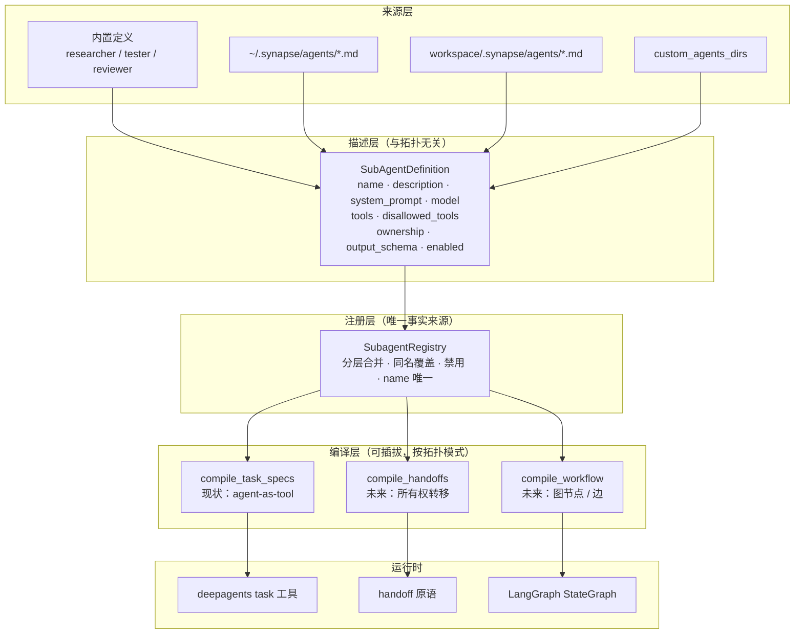
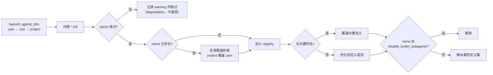
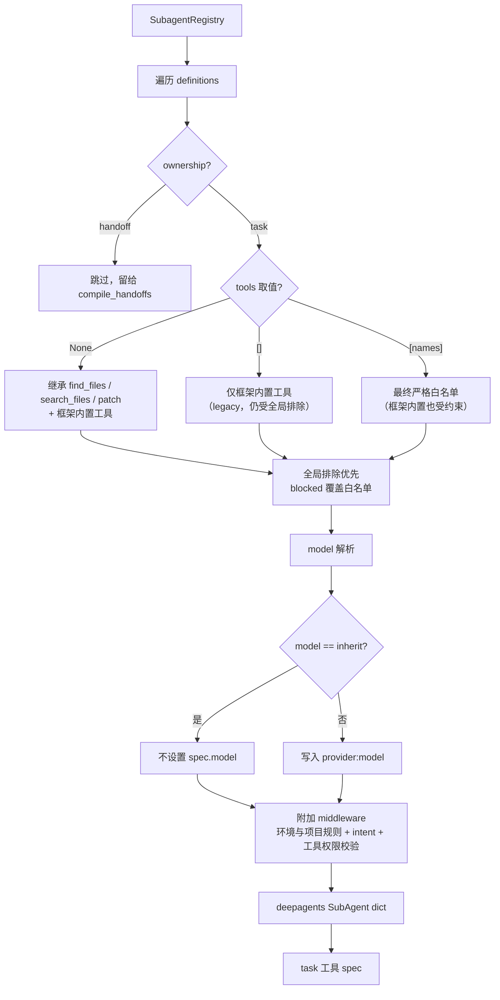
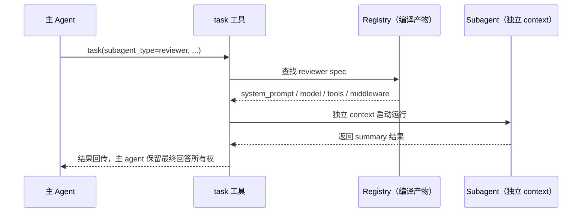
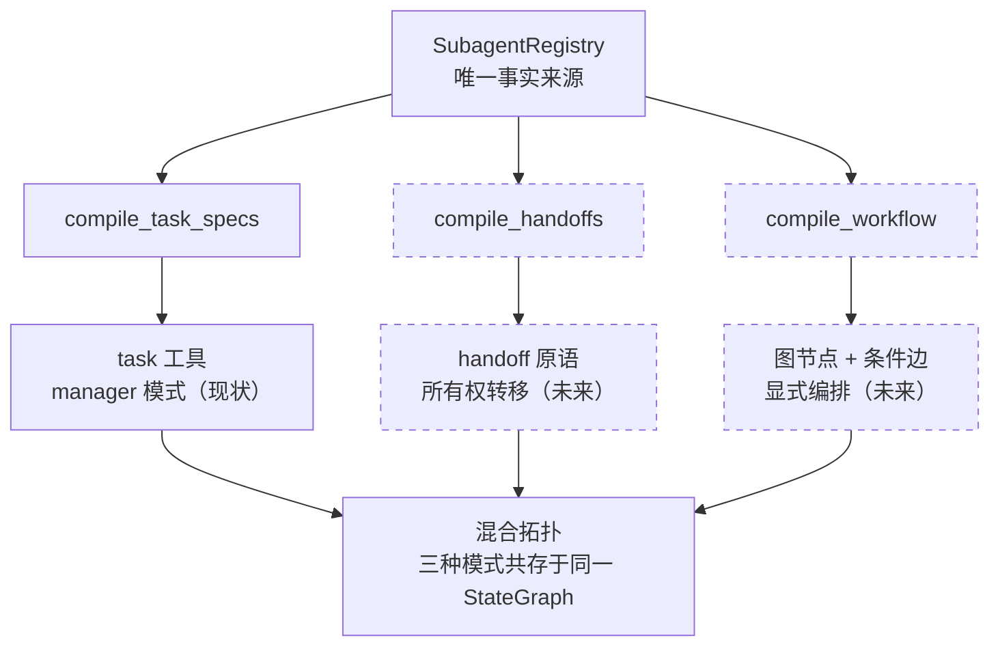

# 子代理（Subagents）

Synapse 的内置子代理（`researcher` / `tester` / `reviewer`）通过 deepagents 的 `task`
工具暴露，采用 **manager 模式（agent-as-tool）**：主 Agent 保留最终回答所有权，子 Agent
做有界任务、返回 summary。

本页描述子代理系统的**三层架构**、**自定义扩展方式**，以及为未来 **handoff** 与
**workflow 编排**预留的演进基础。

## 三层架构

子代理系统把「定义」「注册」「编译」三层解耦，使未来的编排拓扑（handoff、显式图编排）
可以复用同一套定义与注册，而不需要改动解析与加载逻辑。



- **描述层**：`SubAgentDefinition` 是拓扑无关的声明式描述，只回答「这个子代理是谁、能干什么」。
- **注册层**：`SubagentRegistry` 是「有哪些子代理」的唯一事实来源。
- **编译层**：每个拓扑模式一个编译器；当前只有 `compile_task_specs`，未来新增
  `compile_handoffs` / `compile_workflow` 时定义层与注册层零改动。

## 自定义子代理

在用户层 `~/.synapse/agents/*.md` 或项目层 `<workspace>/.synapse/agents/*.md` 放置
Markdown 文件即可新增子代理。YAML frontmatter 提供元数据，文件正文是子代理的
system prompt。

首次启动时（`AGENT_ENABLE_CUSTOM_SUBAGENTS=true`），Synapse 会在
`~/.synapse/agents/` 自动生成 `researcher.md` / `tester.md` / `reviewer.md` 三个
内置定义的种子文件。编辑这些文件即可覆盖对应内置角色；已存在的文件不会被覆盖或
重复生成（除非删除后重启）。同名文件存在但未显式写 `model` 时，
`AGENT_SUBAGENT_*_MODEL` 仍会生效；显式写 `model`（或 `model: inherit`）后由文件接管。

```markdown
---
name: security-reviewer
description: Use after security-sensitive changes. Reviews for injection and secret leaks.
model: inherit            # 或 "provider:model-name"
tools: [read_file, search_files, find_files, execute]   # 非空即最终严格白名单
disallowed_tools: [write_file, edit_file]               # 可选 denylist
ownership: task           # 预留字段，当前仅支持 task
---

You are a security reviewer. Inspect diffs for...
```

### frontmatter 字段

| 字段 | 必填 | 说明 |
| --- | --- | --- |
| `name` | 是 | 唯一标识；与内置同名时覆盖内置定义 |
| `description` | 是 | 主 Agent 据此决定何时委托（路由规则，写具体触发条件） |
| （正文） | 是 | 子代理 system prompt |
| `model` | 否 | `inherit` 或 `provider:model-name`；缺省继承主 Agent 模型 |
| `reasoning_effort` | 否 | `off`/`minimal`/`low`/`medium`/`high`/`max`；缺省继承主 Agent 当前推理级别 |
| `tools` | 否 | 见下文「tools 语义」：`null` 继承 `find_files`/`search_files`/`patch`；`[]` 仅用框架内置工具（仍受全局排除）；`[names]` 为最终严格白名单 |
| `disallowed_tools` | 否 | denylist，作用于继承/allowlist 之后的工具集 |
| `ownership` | 否 | `task` 或 `handoff`（预留）；当前仅 `task` 参与编译 |
| `output_schema` | 否 | 预留：未来 workflow 节点间结构化契约 |
| `enabled` | 否 | `false` 时跳过编译 |

### tools 语义

`tools` 决定子代理最终能看到的工具集合。无论取哪种值，**全局排除始终优先**（见下文
「工具排除规则」），`disallowed_tools` 也在继承 / 白名单之上生效。

| 取值 | 语义 |
| --- | --- |
| 省略 / `null` | 继承主 Agent 的默认白名单 `find_files` / `search_files` / `patch`；deepagents 框架内置工具（`ls`/`glob`/`grep`/`read_file`/`write_file`/`edit_file`/`execute`）照常注入，再由全局排除与 `disallowed_tools` 收敛 |
| `[]` | legacy 行为：只保留框架内置工具，不继承任何主 Agent 工具；全局排除与 `disallowed_tools` 仍然生效，不会因 `[]` 而放开被全局禁止的工具 |
| `[names]` | 非空显式列表现在是**最终严格白名单**：框架内置工具同样受其约束，只有被点名的工具会暴露给模型 |

- 白名单里的名字必须能解析（继承的主 Agent 工具或框架内置工具）；无法解析的名字不会
  自动获得对应能力，只会在日志里记录 warning。
- 被全局排除（settings 的 `excluded_tools`、`minimal_filesystem_tools`、`readonly` 等）
  或被 `disallowed_tools` 禁止的名字，即使写进显式白名单也不会被放开。
- 内置 `tester` 的默认值已由 `[]` 调整为 `null`，因此默认继承
  `find_files`/`search_files`/`patch`；需要旧的「仅框架内置工具」语义时，在定义文件中
  显式写 `tools: []`。
- 已经生成的用户层 `tester.md` 不会被自动覆盖；若其中仍有 `tools: []`，移除该字段或
  改成 `tools: null` 才会采用新的默认继承方式。全局排除仍适用于这些旧文件。
- 修改定义或设置后需重建 Agent（例如重新启动）；已编译的任务不会在执行中切换策略。

## 合并与加载流程

扫描顺序：用户层 → 可执行目录层 → 项目层 → `custom_agents_dirs`。后出现的定义覆盖
同名的先出现定义（项目覆盖用户）。解析失败的文件被跳过并记录 warning，不会导致启动失败。



## 编译流程

`compile_task_specs` 把 `SubAgentDefinition` 编译为 deepagents `SubAgent` dict
（`task` 工具消费）。`ownership != task` 与 `enabled = false` 的定义被跳过，留给未来的
handoff / workflow 编译器。



工具排除规则（`build_tool_exclusion_middleware`）：

- **全局排除优先**：settings 的 `excluded_tools`、`minimal_filesystem_tools` 展开的
  排除集，以及 `readonly` 的只读排除，会和 `disallowed_tools`、内置搜索工具、
  `write_todos`/`todo_write`/`todos`（产品级隔离）一起进入 blocked 集合。blocked 永远
  覆盖继承与白名单，`[]` 或显式白名单都无法把被全局禁止的工具重新放开。
- 请求过滤与执行拦截共用同一判定：被排除的工具既不会出现在模型请求里，强行 / 伪造的
  调用也会在真正执行前被拒绝并返回 permission denied，而不是绕过限制。
- 继承 / 白名单主 Agent 工具时，额外隐藏内置搜索工具 `ls`/`glob`/`grep`（避免与
  `find_files`/`search_files` 重复）。独立使用编译器时可显式选择未被全局禁止的内置搜索
  工具；正常应用装配始终全局排除这三个工具，白名单不能恢复它们。
- 非空白名单会作为 guard 的 `allowed_tools` 传入，使被点名的框架内置工具通过请求过滤，
  但 blocked 仍在其上生效。

## 运行时时序（task 模式）



## 运行环境与隔离

子代理在**独立 context** 中启动，不继承主对话历史；它拿到的 system prompt 由定义正文、
不可覆盖的文件工具路径规则、以及共享环境段落组成：

- **共享 workspace**：主 Agent 与子代理看到同一个真实工作目录（host root）与同一套
  虚拟路径映射（`/` → host root），文件工具调用行为一致。
- **AGENTS 项目规则**：子代理通过 agent-md middleware 注入与主 Agent 相同的 `AGENTS.md`
  项目约定，并复用虚拟路径规范化 middleware。显式工作区缺少该文件时不回退到进程 cwd
  中另一个项目的 `AGENTS.md`。
- **可用 shell**：只有子代理实际能调用 `execute` 时才注入 shell 指引；否则明确告知该
  context 不能运行 shell 命令。`execute` 在 host 上执行，初始 cwd 为 workspace root；
  这不是 OS sandbox，允许的 shell 命令仍能访问当前用户权限内的其他位置。
- **路径范围**：默认只调查当前 workspace，除非用户明确授权其他位置。shell 中的 `.`
  表示工作目录，不能将文件工具的虚拟根 `/` 当成 shell 工作目录。
- **能力边界**：`## Scope limits` 明确区分工具调用权限和工具内部行为。工具级拒绝由
  middleware 强制执行，但不会沙箱化已允许的 shell 或其他工具。当任务需要子代理不具备
  的能力时，要求如实报告，而不是尝试绕过。
- **工具定义一致**：主子代理复用同一 backend、工具 schema、intent 注入和描述精简逻辑；
  子代理不注入已隐藏的 todo / 框架文件系统使用提示。

## 配置字段

| 变量 | 默认值 | 说明 |
| --- | --- | --- |
| `AGENT_ENABLE_SUBAGENTS` | `true` | 启用子代理 |
| `AGENT_SUBAGENT_TESTER_MODEL` | — | Tester 子代理模型 |
| `AGENT_SUBAGENT_REVIEWER_MODEL` | — | Reviewer 子代理模型 |
| `AGENT_SUBAGENT_RESEARCHER_MODEL` | — | Researcher 子代理模型 |
| `AGENT_ENABLE_CUSTOM_SUBAGENTS` | `true` | 加载 `.synapse/agents/*.md` 自定义子代理 |
| `AGENT_CUSTOM_AGENTS_DIRS` | `[]` | 额外扫描目录（JSON 数组） |
| `AGENT_DISABLE_BUILTIN_SUBAGENTS` | `[]` | 禁用的内置子代理名（JSON 数组） |
| `AGENT_SUBAGENT_DEFAULT_MODEL` | — | 子代理全局默认模型 |
| `AGENT_SUBAGENT_DEFAULT_REASONING_EFFORT` | — | 子代理全局默认推理级别 |
| `AGENT_SUBAGENT_MODEL_OVERRIDES_JSON` | `{}` | 按子代理名覆盖模型（JSON 对象） |
| `AGENT_SUBAGENT_REASONING_EFFORT_OVERRIDES_JSON` | `{}` | 按子代理名覆盖推理级别（JSON 对象） |

### 模型与推理级别解析优先级

TUI 中使用 `/subagent` 打开模型配置页，可以设置全局默认与按名覆盖；这些值持久化到分层
`settings.json`。编译时按以下优先级（高 → 低）解析每个子代理的模型与推理级别：

1. 按名覆盖（TUI 中某个子代理的独立配置）
2. 定义文件 frontmatter 中的 `model` / `reasoning_effort`
3. 全局默认（`(Global defaults)`）
4. 全部未配置 → 继承主 Agent 当前模型与推理级别（`inherit`）

两条轴（模型、推理级别）独立解析：只覆盖其中一条不会影响另一条。当显式指定模型
（或只覆盖推理级别）时，子代理使用独立构建的模型实例；推理级别为 `off` 时关闭
thinking，为具体级别时以对应 `reasoning_effort` 开启。未指定推理级别时继承主 Agent
当前会话设置。保存配置后当前 Agent 会立即重建，无需重启。

`inherit` 表示“该层未配置”，等价于删除该层的值：TUI 编辑框中的 `inherit` 不会写入
任何覆盖，因此该角色的 frontmatter 或全局默认仍然生效。按名覆盖始终优先于
frontmatter；只有选择 `inherit`（或删除覆盖）时才会回退到
frontmatter → 全局默认 → 主 Agent。`reasoning_effort` 的合法值为
`off`/`minimal`/`low`/`medium`/`high`/`max`/`inherit`，配置与 frontmatter 均校验。

## 演进路径：handoff 与 workflow

当前只实现了 task 模式（manager 模式）。定义层的 `ownership` 与 `output_schema` 字段、
注册层的唯一事实来源，为两种未来拓扑预留了接入点；届时只需新增编译器。



| 未来模式 | 语义 | 复用本次基础 |
| --- | --- | --- |
| handoff | 子代理接管下一轮响应所有权（OpenAI Agents SDK / Swarm 语义） | 同一 `Definition`/`Registry`；`ownership=handoff` 字段已就位 |
| workflow | 显式图编排：节点 + 条件边 + 结构化 state 契约（LangGraph 语义） | 同一 `Registry`；`output_schema` 字段已就位；底层 StateGraph 原生支持 |

## 兼容性与降级

- 无 `agents/` 目录时，`build_default_subagents()` 仍输出内置三个子代理；但内置 `tester`
  的 `tools` 默认值已由 `[]` 调整为 `null`，默认继承
  `find_files`/`search_files`/`patch`，需要旧语义时显式写 `tools: []`。
- 兼容性收紧：显式非空 `tools: [names]` 现在按**最终严格白名单**处理（框架内置工具也受
  约束，未知名字不自动获得能力），不再是早期的「仅按名过滤主 Agent 工具」。
- 单个定义文件解析失败只跳过该文件，不影响其余定义与启动。
- `permissions` 字段（deepagents FilesystemPermission）与 shell backend 不兼容，本层不暴露，
  隔离通过工具排除 middleware + system prompt 实现，而非 OS sandbox。
