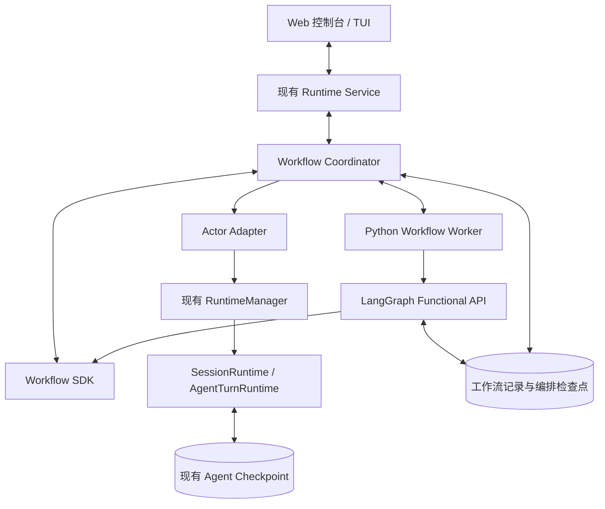

# 动态 Workflow 方案

> 本文定义范围与方案；实时状态在 [实施进度](progress.md)，阶段文档不维护状态。
> 结论：**Python 编排脚本 + LangGraph Functional API + 现有 Agent Runtime**，
> 不引入 Node，不自研脚本重放引擎，也不另造 agent 执行服务。

## 目标

模型根据任务生成一个 Python 编排程序，程序负责循环、分支、动态展开与有界返工，
宿主负责所有持久化与治理动作：

- 调用哪个角色、用哪个结果格式，由**调用点**声明，不绑死在角色上；
- 新增 agent 只需增加角色配置，不需要改调度代码；
- 并发、调用数、超时、取消、审批与用量由执行层强制，不依赖提示词自律；
- 中断后按记录恢复，副作用结果不确定时停下来核验，而不是盲目重试。

## 非目标（首版明确不做）

| 不做 | 原因 |
|---|---|
| 任意脚本的安全沙箱 | 项目本来就是本机可信执行；子进程只用于终止与故障隔离 |
| 修改脚本后继承旧结果 | 需要跨版本缓存语义，首版只支持原脚本、原输入恢复 |
| 嵌套 workflow、跨机 worker、独立 worktree 合并 | 复杂度高，不影响核心架构 |
| 可视化拖拽流程编辑器 | 通过"修改要求"重新生成草案 |
| 静态因果图分析 | 动态 Python 流程无法准确预测；只展示已展开的真实节点 |

## 架构



| 组件 | 职责 | 不负责 |
|---|---|---|
| Workflow Worker | 加载获批脚本，运行 Python 控制流与 LangGraph 编排 | 不装配模型，不另建工具执行体系 |
| Workflow Coordinator | 启动、取消、查询、处理 SDK 请求、关联执行记录 | 不重新解释循环与分支 |
| Actor Adapter | 解析角色，维护 actor 身份，提交与等待 agent 调用 | 不绕过 runtime 直接调用模型 |
| 现有 Agent Runtime | 推理、工具执行、审批、用量、检查点 | 不理解 workflow 业务流程 |
| Web / TUI | 展示快照与节点，发送用户操作 | 不调度节点，不从文本猜状态 |

**worker 使用安装 Synapse 的同一个 Python 环境**，不新增运行时依赖。它存在的理由是
故障隔离：模型生成的脚本若不让出执行权，不应卡住整个 daemon。通过父子进程管道传 JSON，
不新增监听端口，不向 worker 传递模型客户端或凭据。

## 契约

### 三层分离

| 层 | 内容 | 新增 agent 时的改动 |
|---|---|---|
| 角色配置 | 提示词、模型、工具策略 | 新增配置文件 |
| 流程定义 | 脚本引用角色名 | 重新生成或调整脚本 |
| 结果格式 | 调用点声明的 JSON Schema | 通常无需改代码 |

### 脚本接口

模型生成一个入口，只使用 Python 控制流与受记录的 SDK 调用：

```python
async def run(wf, inputs):
    pending = []
    for path in sorted(inputs["files"]):
        reviewer = wf.actor("reviewer", key=f"reviewer:{path}", readonly=True)
        pending.append(
            reviewer.ask(
                key=f"review:{path}",
                prompt="评审该文件的本次改动",
                input={"path": path},
                schema=FINDINGS_SCHEMA,
            )
        )

    reports = await wf.gather(pending)

    verifier = wf.actor("reviewer", key="verifier", readonly=True)
    return await verifier.ask(
        key="verify",
        prompt="复核评审发现，排除没有证据的问题",
        input=reports,
        schema=FINDINGS_SCHEMA,
    )
```

| API | 语义 |
|---|---|
| `wf.actor(role, key=None, readonly=False)` | 引用持久 actor；同 key 延续上下文 |
| `actor.ask(key=..., prompt=..., input=..., schema=...)` | 一次可记录、可恢复的 agent 调用 |
| `wf.gather(calls, limit=None)` | 有界并行等待，结果按提交顺序返回 |
| `wf.approve(key, description)` | 业务确认（例如从评审进入修改） |
| `wf.progress(stage, detail)` | 展示信息，不作为执行状态来源 |
| `return result` | 工作流最终结果 |

`key` 必须由稳定输入（路径、条目 id）构造，**不能依赖完成顺序**。

### 调用身份

- 一次 pass 内同一个 call key 只能用一次，重复即脚本 bug。
- 记录复用必须同时匹配 key 与请求指纹（角色、actor、提示词、输入、schema、readonly）。
- 同 key 不同指纹 → 停止并报告重放不一致，绝不当作缓存命中。
- 并行调用按提交顺序创建身份，完成先后不影响后续 key。

### 结果校验

调用点声明的 schema 由**宿主**校验，而不是信任模型绑定：传给 provider 的 schema 是
"请求"，返回内容仍需验证才能让分支依赖它。校验失败只做一次**禁用业务工具**的格式纠正；
再失败则调用失败。校验错误信息只报告失败的约束与 schema 位置，不回显模型输出。

## 持久化与恢复

三类记录，职责不同：

| 记录 | 权威范围 |
|---|---|
| LangGraph 编排 checkpoint | 工作流任务结果与恢复位置 |
| 工作流运行／调用记录 | 草案、批准、调用身份、确认结果、用量、关键事件 |
| Actor checkpoint | agent 消息、工具执行、待审批状态 |

### 调用完成边界

```text
登记调用（key + 指纹）
      ↓
提交到现有 SessionRuntime
      ↓
agent 完成，留下可识别的完成标记
      ↓
宿主校验结果
      ↓
提交工作流调用结果与关键事件
      ↓
向 worker 返回结果
```

`call_id` 必须进入 agent 请求与持久状态，不能只存在于进程内。同一 actor 的下一次调用
要等上一次结果确认后才提交，避免"actor 已走到第三步、第二步结果未确认"的交错。

### 恢复规则

| 恢复时看到的事实 | 行为 |
|---|---|
| 调用结果已确认，指纹一致 | 返回历史结果，不重新发送请求 |
| agent 有匹配完成标记、工作流结果缺失 | 从明确关联的 checkpoint 核对后补交 |
| agent 正在等待工具审批 | 恢复待审批状态，不重新启动任务 |
| 调用已开始但结果无法确定 | 标记结果不确定，停止自动推进 |

首版不提供"人工填 JSON 后标记成功"，也不提供任意"跳过节点"。证据不足时用户只能查看、
停止旧流程、基于当前工作区创建新草案。

## 执行纪律

| 项目 | 首版规则 |
|---|---|
| 工作流并发 | 同一项目同时只允许一个活跃 workflow |
| 工作区冲突 | workflow 执行期间阻止该项目另起普通执行 turn；仍可查看、审批、取消 |
| 节点并发 | 有效工具集被收窄为只读的 actor 可并行；shell／写入按独占处理 |
| 总并发 | 不超过项目现有 `max_concurrency`，工作流只能进一步降低 |
| 调用数／actor 数 | 调度前硬限制，由存储层强制执行 |
| 用量预算 | 阈值语义：达到后停止新调用，在途调用仍可能增加用量 |
| 取消 | 停止调度、取消运行中 turn、终止 worker；先进入"取消中"，不承诺撤销修改 |
| 工作流修改 | 运行中不热改脚本；停止后生成新草案，批准不继承 |
| 工具审批 | 沿用现有安全配置；启动审批 ≠ 授权其中所有命令 |

这些协调只覆盖同一运行时管理的执行，不能阻止用户编辑器或其他进程修改文件。

## 与现有代码的衔接

| 复用 | 位置 |
|---|---|
| 角色注册与分层覆盖 | `runtime/subagent_specs.py`、`runtime/subagents.py` |
| agent 装配与中间件 | `app/agent.py`、`app/agent_assembly.py` |
| 会话执行、并发配额、取消、审批 | `runtime/sessions/manager.py`、`runtime/sessions/runtime.py` |
| 持久化 | SQLite（`AsyncSqliteSaver`、`sessions/store.py`） |
| 前端行／条目扩展点 | `web/src/components/transcriptRows/`、`composer/actions/` |
| 契约生成 | `runtime/service/contract_registry.py` + `scripts/export_contract_manifest.py` |

新增模块落点：

| 位置 | 内容 |
|---|---|
| `src/synapse/workflows/` | 契约、存储、SDK、worker、coordinator |
| `src/synapse/app/workflow_actor.py` | actor 图与资源装配 |
| `src/synapse/runtime/service/workflows.py` | 纯数据命令、查询与视图 |
| `web/src/stores/workflowStore.ts` | 工作流快照、事件与操作状态 |
| `web/src/components/workflow/` | 草案、详情、节点、审批、恢复视图 |

## 验收场景

| 场景 | 必须观察到的行为 |
|---|---|
| 只读代码评审 | 按实际文件动态展开、有界并行、独立复核、输出经校验 |
| 修复闭环 | 批准后串行修改 → 测试 → 至多两次返工；测试未过不得报告成功 |
| 故障与控制 | 非法输出、重复 key、超并发／预算、取消、审批拒绝、脚本超时、进程中断均有确定状态 |
| 恢复 | 有效完成节点不重复调用；副作用不确定时停下核验；不绕过已记录的预算与审批 |
| 兼容 | 普通聊天与普通 `task` 不受影响；新角色由配置发现 |

**只跑通一次成功示例不算完成**：故障路径与恢复路径同样要有测试证据。
